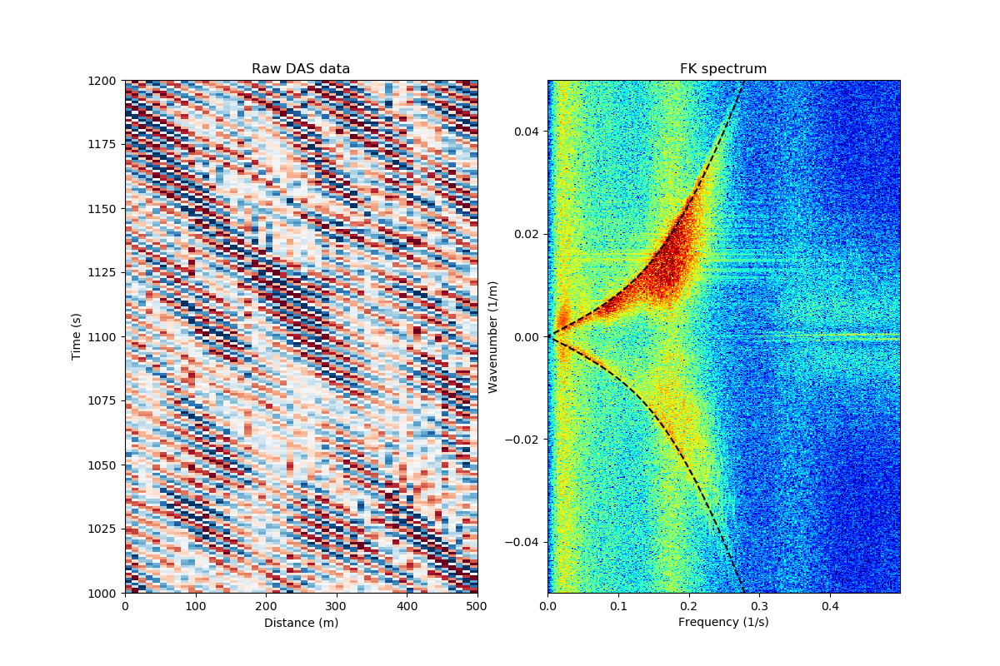
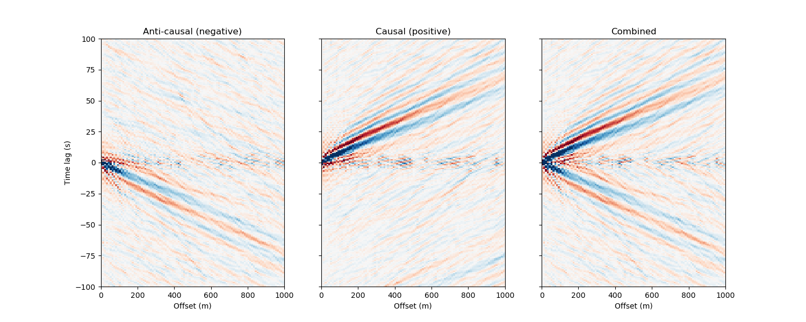
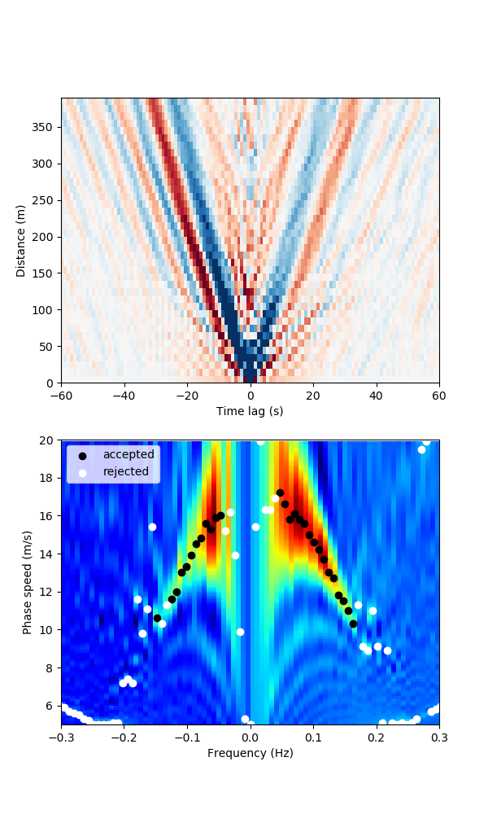
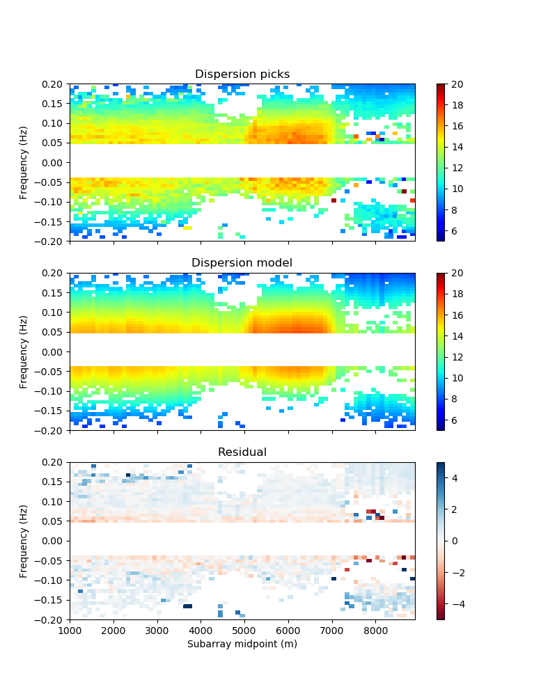
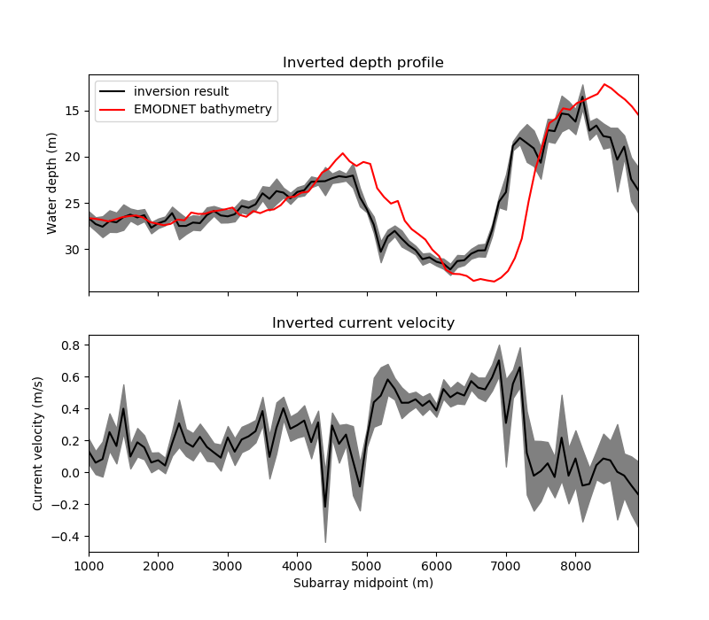
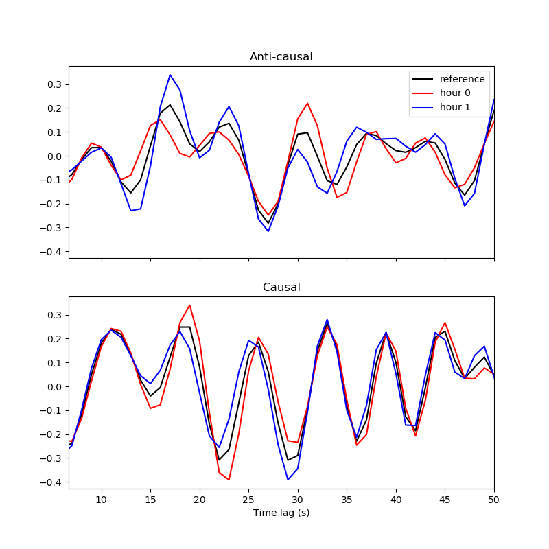
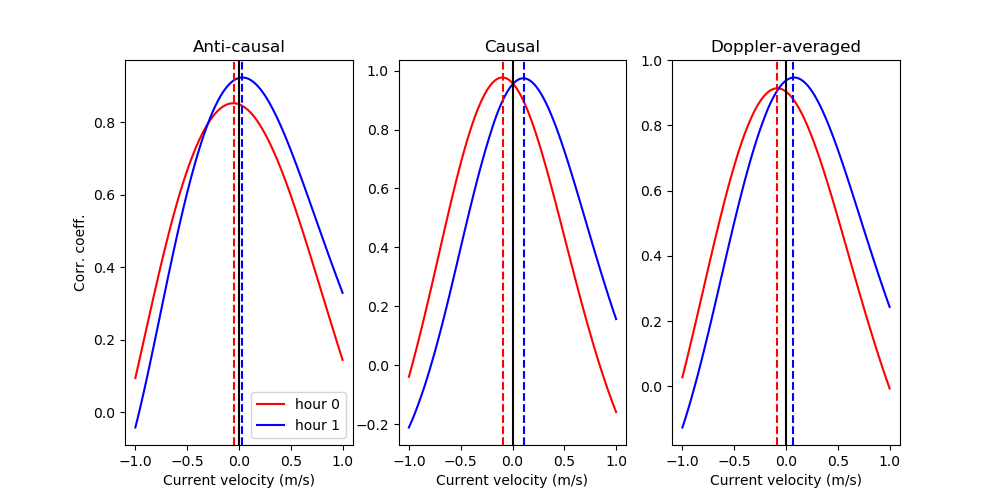
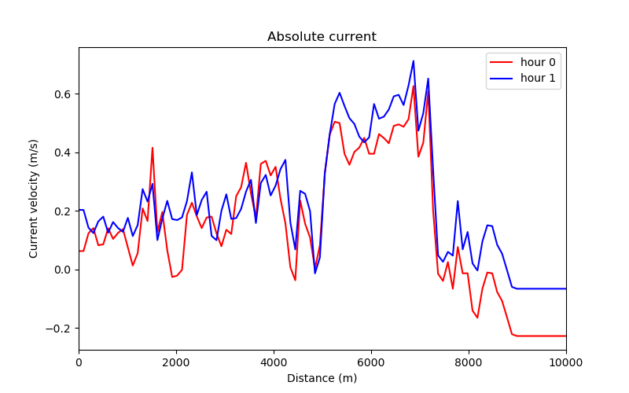

# Supporting code for OSGW interferometry

Williams, E.F., et al. (to be submitted) "Surface gravity wave interferometry and ocean current monitoring with ocean-bottom DAS," <i>EarthArXiv link coming soon</i>

This repository contains example scripts to compute OSGW cross-correlations, measure dispersion, and invert for current speed. The original code for the paper was written in a (messy but fast) combination of Python, Fortran, and CUDA Fortran. Here, I have re-written the key steps in simple Python in order to process a small demonstration set of cross-correlation pairs. 

The example here uses the small dataset from Williams et al. (2019) <i> Nat. Comms.</i>, which can be found on the <a href="http://dx.doi.org/10.22002/D1.1296">CaltechDATA archive</a>. In order to fit this on GitHub, I have cut out only the 10-km segment from 25-35 km cable distance, which includes the large bathymetric feature of Thornton Bank, a tidal sand ridge. The data file included here has been decimated from 10 Hz to 1 Hz simply by averaging. The dataset is 4200 seconds long. Because this dataset is different from the Gibraltar dataset in several respects (shorter, shallower bathymetry, etc.) some of the parameters used in the calculations below are different from those in the manuscript. 

### 01: Visualize data

First, let's take a look at the data. We can clearly see waves propagating in one direction in the raw data (distance vs. time). Taking two FFTs to compute the frequency-wavenumber spectrum over the complete 10-km segment, we can see that there are waves propagating in all directions. The dispersion relation is consistent with linear wave theory, and we can see a large Doppler shift indicating that there is an appreciable current. 

  

### 02: Calculate cross-correlations

We now compute noise correlation functions (NCFs) following the procedure outlined in the manuscript. The notable difference from most codes is that we split the data into two separate workflows using a frequency-wavenumber filter before cross-correlation. This enables us to balance the energy between waves propagating in opposing directions and more easily measure non-reciprocity. 

For the purpose of this demonstration, we are only going to calculate a subset of the Nx(N+1)/2 total possible cross-correlation pairs. We select 2-km overlapping subarrays at an increment of 10 channels (100 m), and calculate the cross-correlation of each channel with the first channel of the subarray (a virtual source gather). We will only use the first few 100 m of this, but the 2-km makes for a nice visualization and gives you the freedom to experiment with the offset parameters below. 

In order to demonstrate the time-lapse monitoring approach, we split the 4200-s dataset into two 2800-s windows (which overlap by 50%)

Note: This step runs for about 10 mins on my laptop computer. 

### 03: Visualize cross-correlations

Here is a plot of our resulting NCFs for an example subarray. You can see how the frequency-wavenumber pre-processing effectively separates out waves propagating in opposite directions, as in the paper. We can then re-combine the causal and anti-causal sides into a composite virtual source gather. 

  

### 04: Measure subarray OSGW dispersion (example)

To obtain the mean state, which we use as a reference for time-lapse monitoring, we stack NCF virtual source gathers for the two "hours". Then, we form dispersion images for each subarray using phase-shift beamforming. The dispersion picks are taken as the maximum value in each frequency bin, and any picks outside the band of interest or below a threshold value are thrown away. This is performed separately on each of the causal and anti-causal sides, and the final picks are combined together.

  

### 05: Measure subarray OSGW dispersion (for all subarrays)

Now, we run this for all subarrays, but only save the dispersion picks. This should go pretty quickly.

### 06: Invert mean state

Given all our picks, we can now fit a model dispersion curve using non-linear least squares and find the values of water depth and current speed that best fit the data. The results are shown below. If you wanted to get rid of the more egregious outliers, you could do this iteratively with the previous step: (1) make initial picks, (2) invert, (3) throw away points above a certain misfit, (4) repeat inversion, etc. You could also enforce smoothness by jointly inverting all subarrays and adding some kind of spatial regularization, with the understanding that the subarrays overlap. See the results below. 

### 07: Visualize dispersion & mean state

  

The results are great (maybe more interesting than the results in the manuscript---pity this dataset is so short). The inverted depth profile closely matches the bathymetry, including the double-crested tidal sand bank in the middle of the cable. We can actually see that our co-registration of the optical distance with cable geometry is off by about 200 m. The current speed is reasonable, and varies in a plausible way. The tides obey the shallow-water equations, so the ~50% reduction in water depth going across Thornton Bank is expected to both increase the amplitude of the tide and cause a phase shift. We can see that the tidal flow in the swale at 5-7 km is out of phase with the tide on either side of the sandbank. 

  

### 08: Measure time-lapse by stretching

Having established a reference state (the water depth along the cable and the mean current speed), we can now go about differential current measurement for the two 2800-s overlapping time windows using the modified stretching method proposed in the manuscript. NCFs for "hour 0" and "hour 1" (our two windows) show a consistent change in the Doppler shift with increasing current velocity with time (faster current along the positive-distance direction is a negative time shift in the causal side because the waves are propagating faster). 

  

Shifting the reference trace to match each hourly NCF, we grid search over a range of possible current velocities. Measuring only the anti-causal or the causal side yields a consistent sign to the change in current speed for this example NCF pair, but the magnitude differs slightly. Combining the two into a single Doppler-averaged correlation coefficient gives us the best estimate. 

  

The script should run pretty quickly. It only performs this stretching step for the NCF pairs with a 200-m offset, though you can change it to see what happens. 

### 09: Visualize time-lapse current

Finally, combining our mean current with the differential measurements for each hour, we get the absolute current as a function of time and distance. Generally, the current increased by ~0.05 m/s from hour 0 to 1 between 5-10 km and stayed the same over the first 5 km. This could reflect the difference in tidal phase going over the Thornton Bank, or just the measurement uncertainty with only 2800-s data windows. 

  

