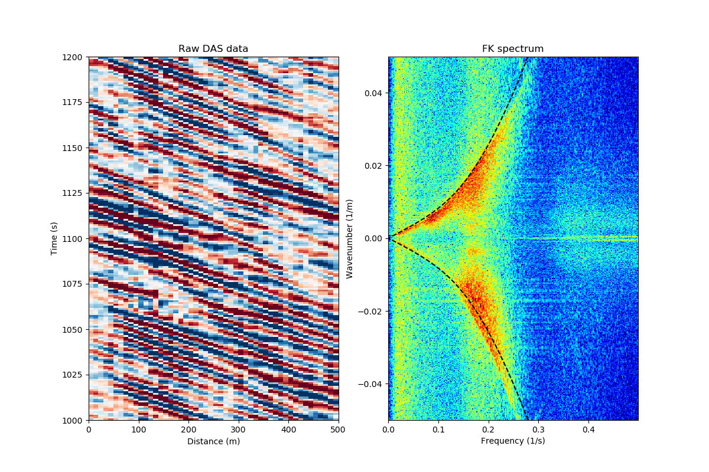
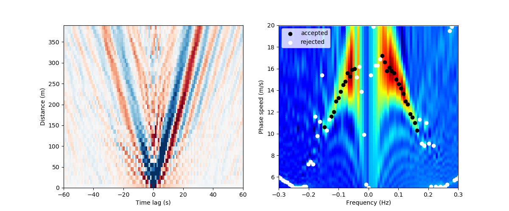

# Supporting code for OSGW interferometry

Williams, E.F., et al. (submitted) "Surface gravity wave interferometry and ocean current monitoring with ocean-bottom DAS," <i>EarthArXiv</i>

This repository contains example scripts to compute OSGW cross-correlations, measure dispersion, and invert for current speed. The original code for the paper (to produce and process over 45000x215 cross-correlations) was written in a (messy but fast) combination of Python, Fortran, and CUDA Fortran. Here, I have re-written the key steps in simple Python in order to process a small demonstration set of cross-correlation pairs. 

The example here uses the small dataset from Williams et al. (2019) <i> Nat. Comms.</i>, which can be found on the <a href="http://dx.doi.org/10.22002/D1.1296">CaltechDATA archive</a>. In order to fit this on GitHub, I have cut off the first 10 km and last 1.9 km, then crudely decimated from 10 Hz to 1 Hz by averaging. 

### 01: Visualize data

  

  

### 02: Calculate cross-correlations

### 03: Visualize cross-correlations

  

### 04: Measure subarray OSGW dispersion (example)

  

### 05: Measure subarray OSGW dispersion (for all subarrays)

### 06: Invert mean state

### 07: Visualize dispersion & mean state

  

  

### 08: Measure time-lapse by stretching

### 09: Visualize time-lapse current

